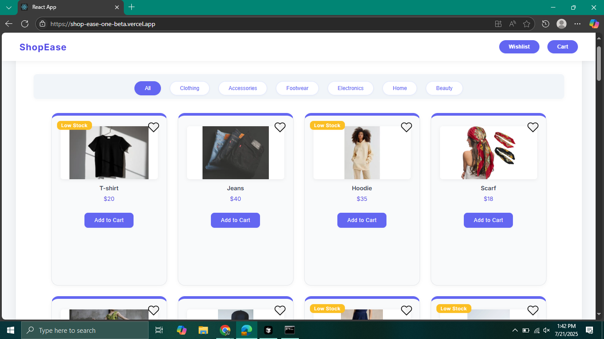

# ShopEase - A Simple E-commerce Application

ShopEase is a modern and responsive e-commerce application built with React. It demonstrates a complete shopping flow, from browsing products and managing a cart to a seamless checkout process. The application is designed to be clean, intuitive, and user-friendly.

### ✨ [Live Demo](https://shop-ease-one-beta.vercel.app/)





## Features

-   **Product Catalog:** Browse a clean, responsive grid of products.
-   **Category Filtering:** Easily filter products by category to find what you're looking for.
-   **Product Details:** View detailed information about each product in a modern modal.
-   **Wishlist:** Add or remove items from a personal wishlist.
-   **Shopping Cart:** Add products to the cart, update item quantities, and see the total price update in real-time.
-   **Toast Notifications:** Receive instant feedback for actions like adding items to the cart or wishlist.
-   **Checkout Process:** A seamless, single-page checkout modal with payment options.
-   **Responsive Design:** A mobile-friendly layout that looks great on any device.

## State Management Approach

The state management in this application is handled using a combination of **React's Context API** for global state and the **`useState` hook** for local, component-specific state.

-   **Global State (Context API):**
    -   **`CartContext`**: Manages the state of the shopping cart, including the items and total price.
    -   **`WishlistContext`**: Manages the user's wishlist.
    -   **`ToastContext`**: Handles the display of toast notifications across the application.
    This approach allows shared data to be accessed by any component without "prop drilling."

-   **Local State (`useState`):**
    -   Used for component-specific state, such as modal visibility, form inputs (like the selected payment method), and UI state (like the active product category).

This hybrid strategy demonstrates a modern and efficient approach to state management in React.

## Getting Started

To get a local copy up and running, follow these simple steps.

### Prerequisites

-   Node.js (v14 or later)
-   npm or yarn

### Installation

1.  **Clone the repository:**
    ```sh
    git clone https://github.com/TahreemShahid/shopEase.git
    ```
2.  **Navigate to the project directory:**
    ```sh
    cd shopEase
    ```
3.  **Install NPM packages:**
    ```sh
    npm install
    ```

### Running the Application

To start the development server, run:

```sh
npm start
```

This will run the app in development mode. Open [http://localhost:3000](http://localhost:3000) to view it in your browser. The page will reload when you make changes.

## Built With

-   [React](https://reactjs.org/) - A JavaScript library for building user interfaces.
-   [Create React App](https://create-react-app.dev/) - The project boilerplate.
-   [CSS](https://developer.mozilla.org/en-US/docs/Web/CSS) - For custom styling and responsive design.

## Deployment

This application is deployed on [Vercel](https://vercel.com/). Vercel provides a fast and easy way to deploy modern web projects, with seamless integration from GitHub.
